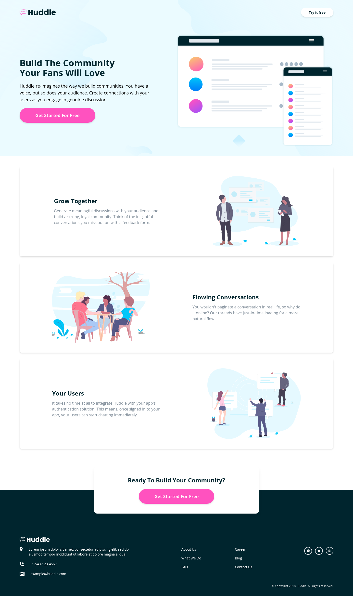
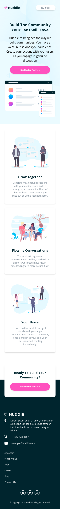

# Frontend Mentor - Huddle landing page with alternating feature blocks solution

This is a solution to the [Huddle landing page with alternating feature blocks challenge on Frontend Mentor](https://www.frontendmentor.io/challenges/huddle-landing-page-with-alternating-feature-blocks-5ca5f5981e82137ec91a5100). Frontend Mentor challenges help you improve your coding skills by building realistic projects.

## Table of contents

- [Overview](#overview)
  - [The challenge](#the-challenge)
  - [Screenshot](#screenshot)
  - [Links](#links)
- [My process](#my-process)
  - [Built with](#built-with)
  - [Useful resources](#useful-resources)
- [Author](#author)

## Overview

### The challenge

Users should be able to:

- View the optimal layout for the site depending on their device's screen size
- See hover states for all interactive elements on the page

### Screenshot

### Links

- Solution URL: [Solution URL](https://your-solution-url.com)
- Live Site URL: [Live site URL](https://dodolight.github.io/huddle-landing-page-challenge)

## My process

### Built with

- Flexbox
- Mobile-first workflow
- [React](https://reactjs.org/) - JS library
- [Tailwindcss](https://tailwindcss.com) - A utility-first CSS framework

### Useful resources

- [Tailwindcss](https://tailwindcss.com) - This is the official website of tailwindcss,it helps me to learn more about tailwind classes and use them to customize my project as I wanted.

## Author

- Website - [Website](https://dodolight.github.io/huddle-landing-page-challenge)
- Frontend Mentor - [@Dodolight](https://www.frontendmentor.io/profile/Dodolight)
- Twitter - [@Donan82838492](https://www.twitter.com/Donan82838492)
